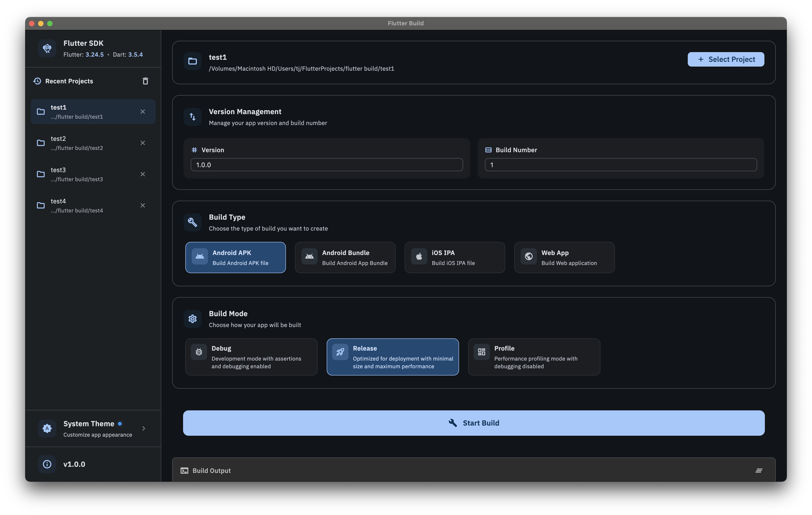
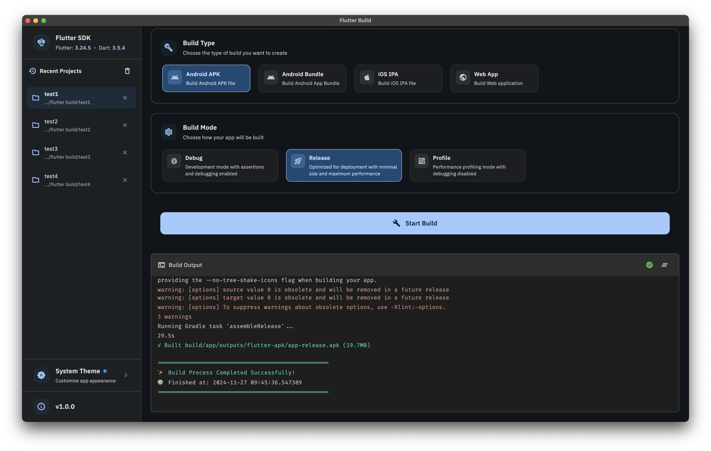

  

# Flutter Build

A powerful Flutter application that streamlines the build and deployment process for your Flutter projects.

## 📱 Screenshots

  &nbsp;&nbsp;
  &nbsp;&nbsp;
  

## 📥 Download

Download and install the appropriate package for your operating system:
- macOS: [flutter-build.dmg](https://github.com/Tjpatel16/flutter_build/releases/tag/v1.0.0%2B1)
- Windows: Coming soon
- Linux: Coming soon

## ✨ Features

### 🚀 Build Management
- Cross-platform build support (iOS, Android, Web)
- Platform-specific build configurations
- iOS IPA builds (macOS only)
- Android APK and App Bundle generation
- Web application builds
- Multiple build modes (Debug, Release, Profile)

### 🔄 Project History
- Track all your previous builds
- View build timestamps and configurations
- Quick access to recent projects
- Build status monitoring
- Detailed build logs

### 🎨 User Interface
- Modern, intuitive design
- Real-time build progress
- Interactive terminal output
- Dark and light theme support
- Responsive layout for all screen sizes

### ⚡ Performance
- Fast build process
- Efficient dependency management
- Optimized build configurations
- Parallel build support
- Minimal resource usage

### 🛠️ Developer Tools
- Version management
- Build configuration presets
- Project validation
- Error handling and reporting
- Build output organization

## 🚀 Getting Started

### Prerequisites

- Flutter SDK (latest version)
- Xcode (for iOS builds)
- Android Studio (for Android builds)

## 🛠️ Usage

1. Open the app
2. Select or create a new Flutter project
3. Configure build settings
4. Start the build process
5. Monitor build progress
6. Access build history for previous builds

## 📝 License

This project is licensed under the MIT License - see the [LICENSE](LICENSE) file for details.
